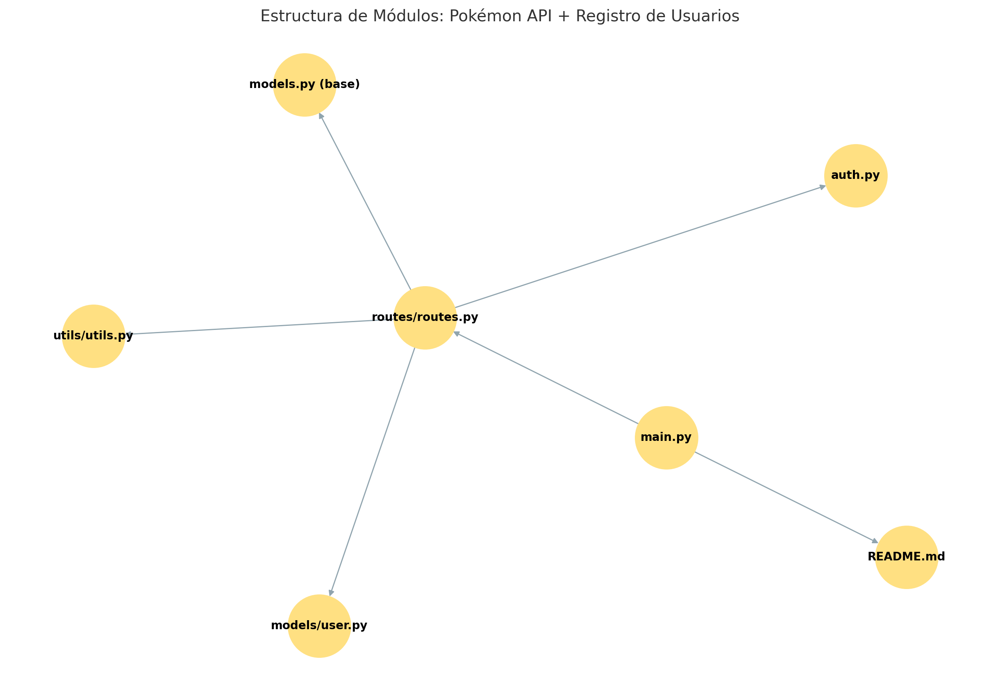

# 🧠 API con FastAPI - Proyecto de Aprendizaje

Este repositorio contiene una API desarrollada con **FastAPI**, enfocada en aprender buenas prácticas de desarrollo backend, validación de datos, modularización de rutas y consumo de APIs externas. 

> Proyecto realizado por [Rubén Luis Manríquez Salles](mailto:ruben.msalles@gmail.com), como parte de su portafolio profesional.

---

## 🚀 Tecnologías utilizadas

- [FastAPI](https://fastapi.tiangolo.com/)
- [Pydantic](https://docs.pydantic.dev/)
- [Uvicorn](https://www.uvicorn.org/)
- [PokeAPI](https://pokeapi.co/) (API pública)
- Python 3.12

---

## 📁 Estructura del proyecto

```
app/
├── main.py             # Punto de entrada de la aplicación
├── models.py           # Modelos Pydantic para validación
├── routes/
│   └── routes.py       # Endpoints agrupados con APIRouter
├── utils/
│   └── pokemon.py      # Funciones auxiliares (API externa)
└── __init__.py         # Inicializador del paquete
├── requirements.txt
├── .gitignore
├── README.md
└── estructura.png

```

---

## 📌 Endpoints disponibles

### 1. `GET /`
Retorna un mensaje de bienvenida.

```json
{
  "mensaje": "¡Bienvenido a tu primera API con FastAPI!"
}
```

---

### 2. `GET /saludo/{nombre}`
Retorna un saludo personalizado.

**Ejemplo**:
```
GET /saludo/Kai
```

**Respuesta**:
```json
{
  "mensaje": "Hola, Kai. Bienvenido a FastAPI👋"
}
```

---

### 3. `POST /registro`
Registra un usuario, validando que el nombre contenga solo letras y espacios.

**Body JSON:**
```json
{
  "nombre": "Rubén",
  "edad": 40
}
```

**Respuesta exitosa (201):**
```json
{
  "mensaje": "Usuario Rubén de 40 años registrado correctamente."
}
```

**Errores posibles:**
- `400`: Nombre con números o símbolos.
- `422`: Edad menor o igual a 0.

---

### 4. `GET /pokemon/{nombre}`
Consulta información de un Pokémon usando la [PokeAPI](https://pokeapi.co/).

**Ejemplo**:
```
GET /pokemon/pikachu
```

**Respuesta**:
```json
{
  "nombre": "pikachu",
  "altura": 4,
  "peso": 60,
  "tipos": ["electric"],
  "habilidades": ["static", "lightning-rod"],
  "imagen_url": "https://raw.githubusercontent.com/PokeAPI/sprites/master/sprites/pokemon/25.png"
}
```

---

## 🧪 Cómo ejecutar el proyecto

1. Clona el repositorio:
```bash
git clone https://github.com/Eoloth/API
cd api-fastapi-ejemplo
```

2. Crea un entorno virtual (opcional pero recomendado):
```bash
python -m venv venv
source venv/bin/activate  # En Windows: venv\Scripts\activate
```

3. Instala las dependencias:
```bash
pip install -r requirements.txt
```

4. Ejecuta el servidor:
```bash
uvicorn app.main:app --reload
```

5. Visita la documentación interactiva:
- Swagger UI: http://127.0.0.1:8000/docs
- Redoc: http://127.0.0.1:8000/redoc

---

## 📌 Estado del proyecto

✅ Funcional y listo para mostrar en portafolio.  
🚧 Se puede extender con base de datos, autenticación JWT o despliegue en la nube.

---
## Estructura del Proyecto



---

## 📧 Contacto

Rubén Luis Manríquez Salles  
📬 ruben.msalles@gmail.com  
🌐 [Portafolio Web](https://rubenmanriquez.github.io)  
🔐 [TryHackMe (Top 1%)](https://tryhackme.com/p/Eoloth) 

---

## 🧠 Licencia

MIT License — libre uso educativo y profesional.
